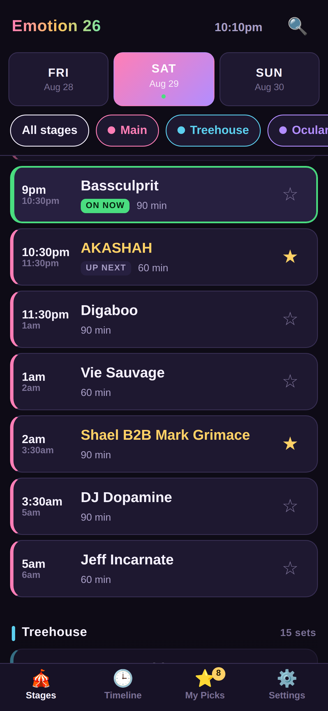
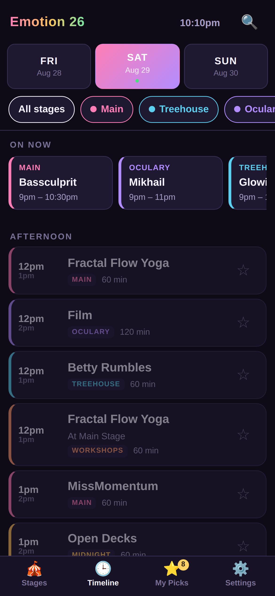
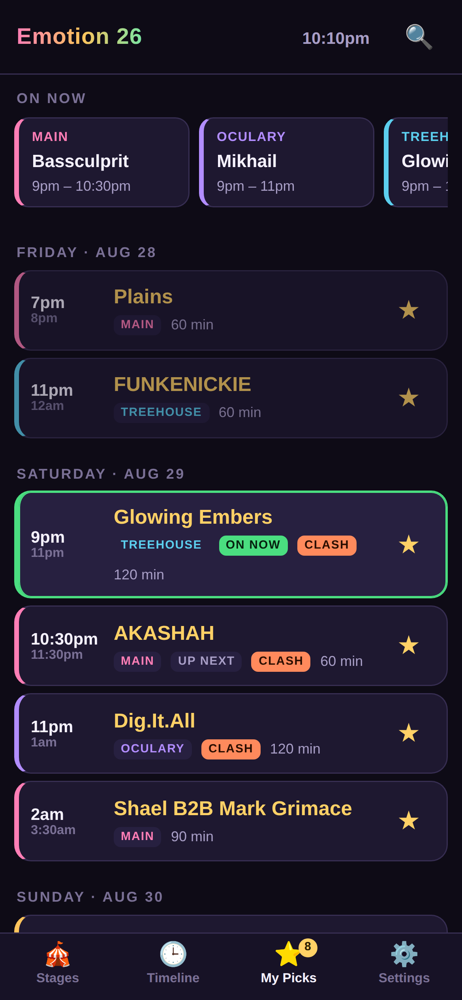

# Emotion 26 — Festival Schedule

A phone-first web app for the full three-day lineup — five stages plus the
workshop track. Open it in any
browser, star the sets you want, get a heads-up before each one starts.

No accounts, no server, no app store. It's plain HTML, CSS and JavaScript — one
folder you can drop on any static host.

**https://sociussolutions.github.io/emotion26/**

| Stages | Timeline | My Picks |
|---|---|---|
|  |  |  |

All screenshots and the share card are downloadable from
**[/press](https://sociussolutions.github.io/emotion26/press.html)**, individually
or as [one zip](https://sociussolutions.github.io/emotion26/assets/screenshots/emotion26-screenshots.zip).

## What it does

**Browse**

- **Stages** — the day split by stage, the way the printed flyers read.
- **Timeline** — every stage merged into one chronological list, grouped into
  Afternoon / Evening / Night / Late night. This is the planning view.
- Day tabs for Friday / Saturday / Sunday, or just swipe left and right.
- Stage chips to hide stages you're not going to walk to.
- **Workshops** are a sixth track alongside the five music stages, so a hoop
  class and a DJ set clash with each other the same way two DJ sets do. Each
  one carries its host and, where it isn't at The Glow Lounge, its location.
- Search finds an artist **across the whole weekend**, not just the day you're
  looking at — useful, since several acts play more than one stage.

**Know what's happening now**

- An **On now** strip across the top shows what's playing on every stage at this
  moment. Tap a card to jump to it. Before the gates open it shows what's up
  next instead.
- Open the app during the festival and it lands on today, scrolled to the set
  that's playing right now.
- Tap the clock in the header at any time to jump back to now.
- Sets currently playing get a green outline; finished sets fade out (or hide
  entirely — there's a setting).

**Your own schedule**

- Tap any set — or its star — to add it to **My Picks**.
- My Picks lists everything you've starred in time order across all three days.
- **Clash detection**: two picks on different stages that overlap get flagged,
  because you can't be in two places at once.
- **Share my schedule** hands someone a link that carries your picks in the URL.
  Opening it asks whether to merge with theirs or replace. Nothing is uploaded
  anywhere — the picks travel inside the link itself.
- **Copy as plain text** for pasting into a group chat.

**Reminders**

- Turn on notifications and pick a heads-up time (5 / 10 / 15 / 30 minutes) and
  the app notifies you before each starred set.
- Reminders are generated by the page itself, so it needs to be open or added
  to the home screen and left running in the background. There's no push
  server. On iOS, notifications only work when the app has been added to the
  home screen (Share → Add to Home Screen) — that's a Safari restriction.

**Install to the phone**

- A dismissible banner offers to add the app to the home screen. On Android it
  is a one-tap install; on iOS it spells out the Safari Share → Add to Home
  Screen steps, since Safari gives a page no way to trigger that itself.
- Dismissing the banner doesn't lose it — the same offer lives in Settings.
- It hides itself once the app is running from the home screen.

**Works with no signal**

- A service worker caches everything on first visit, so the schedule loads with
  zero bars, which is the normal state of affairs in a field.
- Add to home screen and it opens full-screen like a normal app.

**Readable**

- Dark by default (easier at 3am, kinder to your battery), light theme in
  Settings. 12- or 24-hour clock. Big type, 44px tap targets, colour-coded
  stages, and every control is keyboard- and screen-reader-labelled.

## Running it

Any static file server works. Locally:

```bash
python3 -m http.server 8000
# then open http://localhost:8000
```

Opening `index.html` straight off disk works too, minus offline caching and
notifications — browsers only allow those over `http(s)`.

## Deploying

The site is live at

**https://sociussolutions.github.io/emotion26/**

GitHub Pages is configured as **Deploy from a branch** — `main`, root folder —
so pushing to `main` publishes within a minute or two. There is no build step
and no deploy workflow to keep working; Pages serves these files as they are.
(`.nojekyll` is what stops Pages running the files through Jekyll first.)

Anything else that serves static files works identically — Netlify, Vercel,
Cloudflare Pages, or an S3 bucket.

If you ever switch Pages to the **GitHub Actions** source, you'll need a
deploy workflow again; `actions/upload-pages-artifact` with `path: .` plus
`actions/deploy-pages` is all it takes.

## Editing the schedule

Everything lives in [`js/data.js`](js/data.js). Nothing else needs to change.

A stage/day is a list of `["HH:MM", "Artist"]` pairs in 24-hour time, **in
running order**:

```js
['21:00', 'Bassculprit'],
['22:30', 'AKASHAH'],
['23:30', 'Digaboo'],
['01:00', 'Vie Sauvage'],   // 1am — see below
['06:00', null]             // stage closed
```

- A set runs until the **next entry**. To shorten one, add a `null` entry where
  it should end. To lengthen it, delete the entry after it.
- An optional **third item** is a note shown under the name — a host, a
  location, a prerequisite: `['11:00', 'Guided Paint Experience', "At Art N' Groove"]`.
  Notes are searchable, so people can find everything at a given location.
- **After midnight is automatic.** Any time that isn't later than the line above
  it rolls to the next morning. `23:30` then `01:00` puts that set at 1am the
  following day. You never write a date.
- **Always end a list with a `null`** at the stage's closing time, or the last
  set is assumed to be one hour long.
- To move the festival, change the three `date` fields at the top of the file.
- To add or rename a stage, edit the `stages` array and add a matching key under
  `schedule`. Colours flow through the whole UI automatically. A stage may also
  carry a `venue` (shown under its name), a `note` (a callout above its list)
  and a `unit` (what the header counts — "sets" unless you say otherwise).

One caveat on **share links**: they carry picks as `stage.day.time`, so they
survive new stages and renamed artists, but a pick whose *start time* you edit
won't come back when an old link is opened. If you re-time a set after people
have shared schedules, they'll need to re-star that one.

### About the times

The lineup was transcribed from the flyer images. Start times and artist names
are read directly off them; where a flyer's colour bands made a set's exact
length ambiguous (mostly the after-midnight Main Stage slots and the gaps in
The Oculary's day), the end time is inferred from when the next act starts.
If any of it is wrong, the fix is a one-line edit in `js/data.js`.

Notown has no Friday programme on the flyer, so it simply doesn't appear on
Friday.

## Files

```
index.html              app shell
css/app.css             all styles
js/data.js              the schedule — the only file most edits touch
js/app.js               all app logic
sw.js                   service worker (offline cache + notification clicks)
manifest.webmanifest    home-screen install metadata
assets/                 app icons
assets/og.png           1200x630 link-preview card
assets/screenshots/     phone screenshots (also shown in the install prompt)
```

## Link previews

Pasting the URL into iMessage, Slack, Discord, Facebook or a text post shows a
card built from the Open Graph tags in `index.html`, using
`assets/og.png` (1200×630).

`og:image` and `og:url` are absolute URLs pointing at
`sociussolutions.github.io` — scrapers ignore relative paths, so if the site
ever moves to another domain those two tags have to be updated by hand.

To regenerate the card after a branding or date change, edit the tags and
re-render the image at 1200×630. Most platforms cache previews aggressively;
Facebook's Sharing Debugger and LinkedIn's Post Inspector can force a re-scrape,
and Slack/Discord usually refresh within a day.
